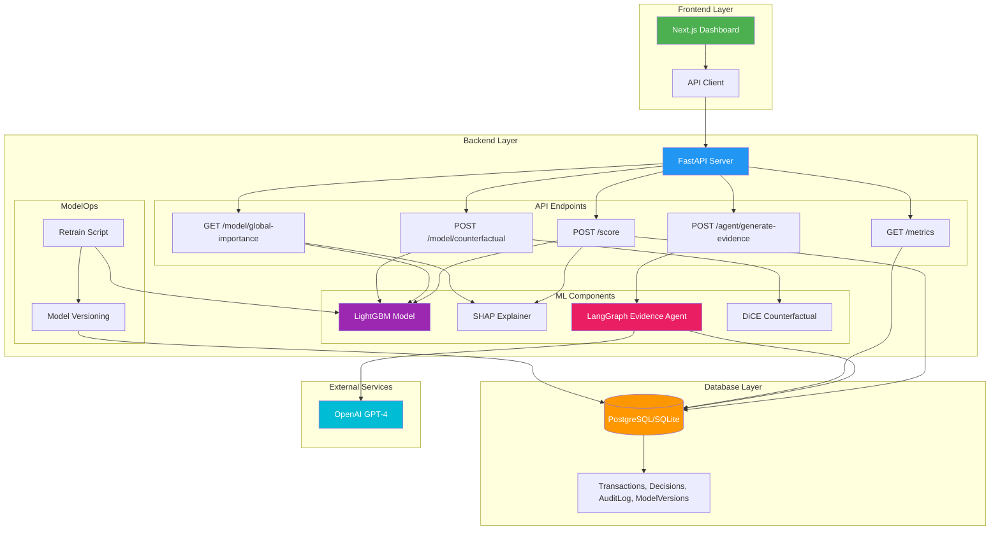

# ChargeGuard Architecture Diagram

## Component Descriptions

### Frontend Layer
- **Next.js Dashboard**: React-based UI for monitoring transactions, viewing evidence, and managing disputes
- **API Client**: TypeScript client for backend communication

### Backend Layer
- **FastAPI Server**: Python REST API with async support
- **API Endpoints**:
  - `/score`: Real-time fraud scoring with SHAP explanations
  - `/agent/generate-evidence`: AI-powered evidence generation
  - `/model/global-importance`: Global feature importance visualization
  - `/model/counterfactual`: Counterfactual explanations (what-if analysis)
  - `/metrics`: Model performance metrics

### ML Components
- **LightGBM Model**: Gradient boosting model for fraud detection
- **SHAP Explainer**: Model explainability using SHAP values
- **LangGraph Evidence Agent**: 3-node workflow (ASSEMBLE → DRAFT → SELF-CHECK) using GPT-4
- **DiCE**: Counterfactual explanation generation

### ModelOps
- **Retrain Script**: Manual retraining pipeline with evaluation
- **Model Versioning**: Database-backed model tracking and rollback

### Database Layer
- **PostgreSQL/SQLite**: Transactional database with fallback support
- **Tables**: Transactions, Decisions, AuditLog, ModelVersions

### External Services
- **OpenAI GPT-4**: LLM for evidence generation and validation

## Data Flow

1. **Transaction Scoring**: Dashboard → API → Model + SHAP → Database
2. **Evidence Generation**: Dashboard → API → Evidence Agent → OpenAI → Database
3. **Model Monitoring**: Dashboard → API → SHAP → Global Importance
4. **Model Retraining**: Retrain Script → New Model → Model Version → Database
